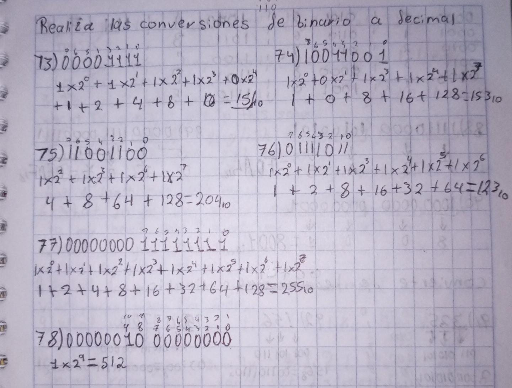
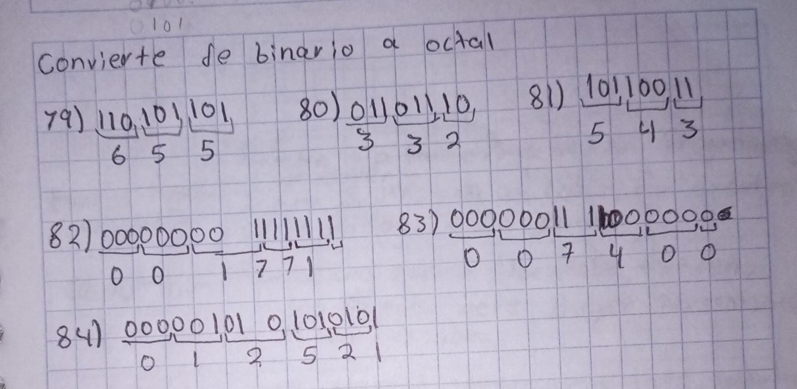
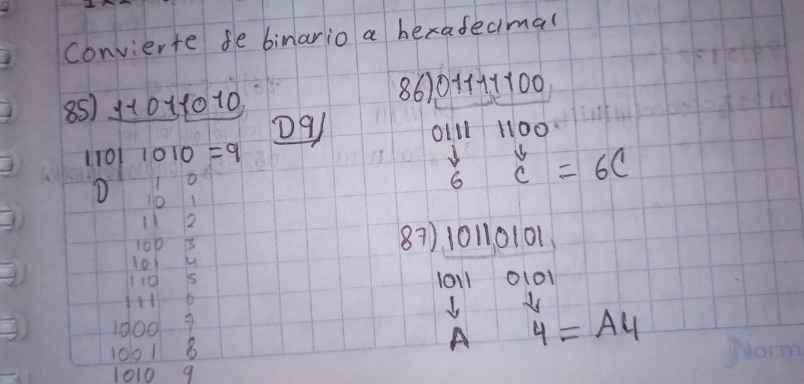
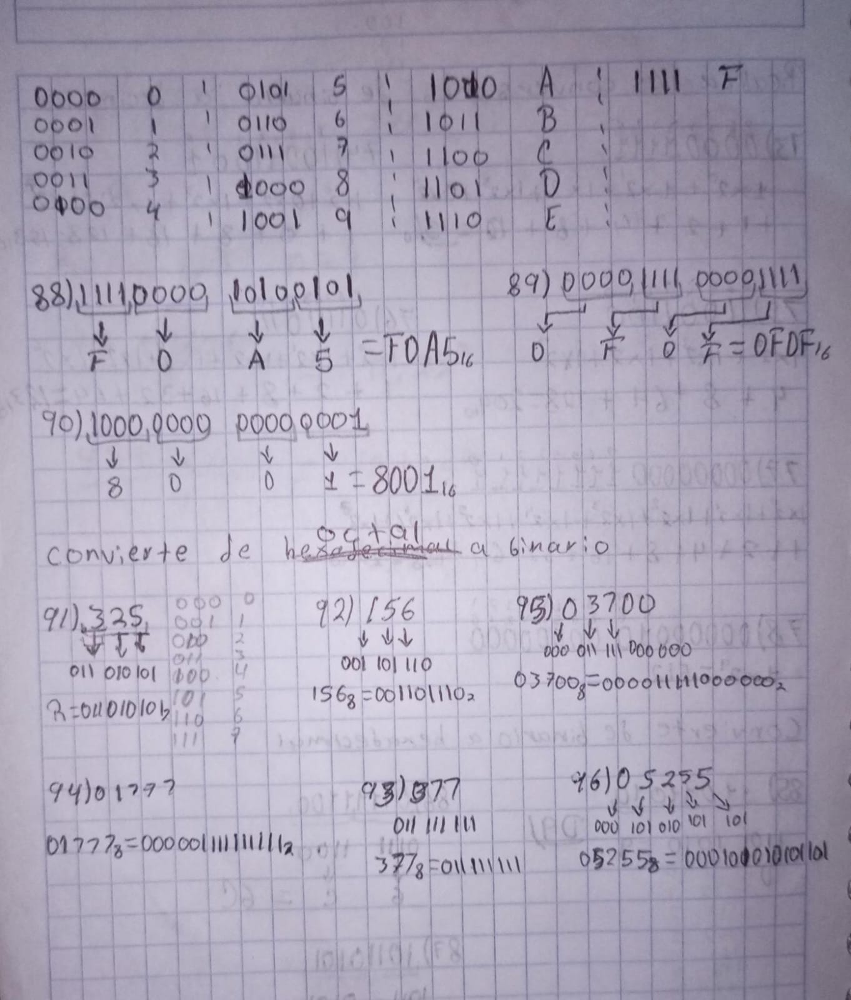
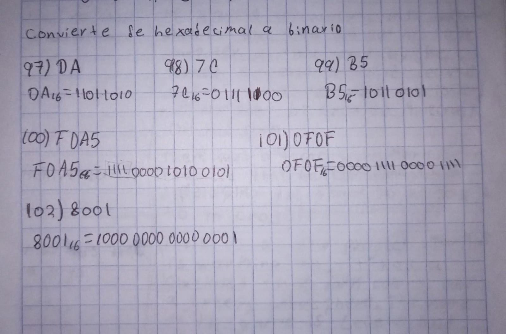

# Actividad 8. Ejercicios-Expresiones algebraicas

Trabajo relizado por: Rafael Antonio Burgos Chi
Fecha: 22/09/2026

---
## Realiza las conversiones de binario a decimal

---
## Convierte de binario a octal

## Convierte de binario a hexadecimal

## Convierte de octal a binario

## Convierte de hexadecimal a binario

